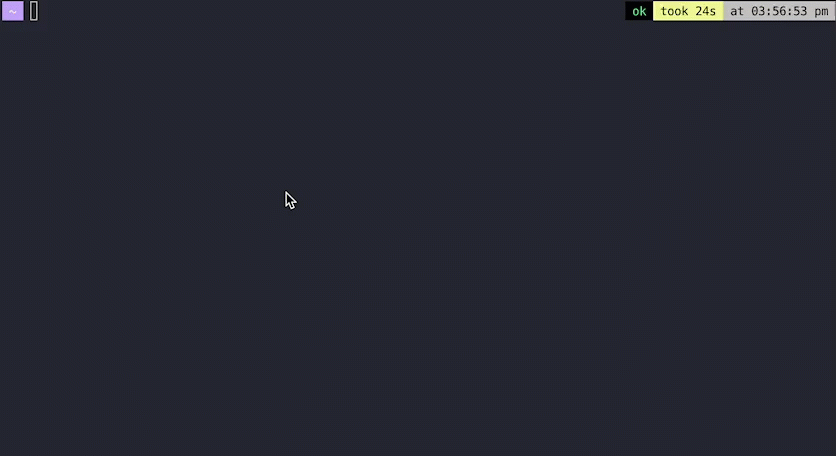

# Natural Language Shell (nlsh)

[](https://github.com/abakermi/nlsh/actions/workflows/release.yml)
[](https://github.com/abakermi/nlsh/releases/latest)
[](https://github.com/abakermi/nlsh)


A command-line tool that converts natural language instructions into shell commands using OpenAI's GPT-3.5 model. Simply describe what you want to do in plain English, and nlsh will generate and execute the appropriate shell command.

## Features

- Natural language to shell command conversion
- Interactive mode for multiple commands
- Direct command mode for single instructions
- Safe command execution with built-in safeguards

## Prerequisites

- Go 1.21 or later
- OpenAI API key

## Installation

### Option 1: Quick Install

Install directly using curl:
```bash
curl -fsSL https://raw.githubusercontent.com/abakermi/nlsh/main/install.sh | bash
```

### Option 2: Manual Installation

1. Clone the repository:
   ```bash
   git clone https://github.com/abakermi/nlsh.git
   cd nlsh
   ```
2. Set your OpenAI API key as an environment variable:
   ```bash
   export OPENAI_API_KEY='your-api-key-here'
   ```
3. Run the installation script:
   ```bash
   ./install.sh
   ```
4. Restart your terminal or source your shell configuration:
   ```bash
   source ~/.zshrc  # or source ~/.bashrc
   ```

## Usage

### Interactive Mode

Start the interactive shell by running:
```bash
nlsh
```

You'll see a prompt where you can type your natural language requests:
```
Natural Language Shell (nlsh) - Type 'exit' to quit
Enter your request in natural language:
> list all files in the current directory
Executing: ls
```

### Direct Command Mode

Execute a single command directly:
```bash
nlsh "show me the disk usage in human-readable format"
Executing: df -h
```

## Examples

Here are some example requests you can try:

- "show me all running processes"
- "what's the current directory"
- "find all pdf files in the current directory"
- "show system information"
- "create a new directory called test"

## Error Handling

- If your request is unclear, nlsh will ask you to be more specific
- If a command fails to execute, you'll see the error message
- Invalid API keys or missing environment variables will be reported

## Security

The system prompt includes safety checks to prevent harmful commands. However, always review the generated command before execution in critical environments.

## License

This project is open source and available under the MIT License.