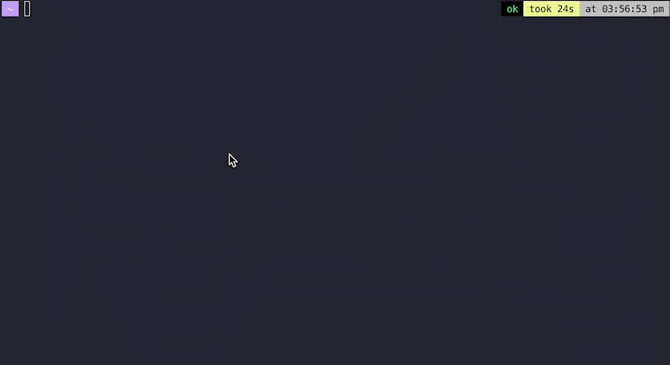

# Natural Language Shell (nlsh)

[](https://github.com/abakermi/nlsh/actions/workflows/release.yml)
[](https://github.com/abakermi/nlsh/releases/latest)
[](https://github.com/abakermi/nlsh)



A command-line tool that converts natural language instructions into shell commands using AI. Simply describe what you want to do in plain English, and nlsh will generate and execute the appropriate shell command.

## Features

- 🧠 Natural language to shell command conversion
- 🤖 Multiple AI backends: OpenAI GPT and Google Gemini
- 🛡️ Built-in safety checks for dangerous commands
- ⚙️ Configurable settings via `.nlshrc`
- 🎨 Colored output for better readability
- 📝 Command history and context awareness
- 🔄 Interactive and single command modes
- 🔒 Confirmation for potentially dangerous operations

## Prerequisites

- Go 1.24 or later
- OpenAI API key or Google Gemini API key

## Installation

### Option 1: Quick Install

Install directly using curl:
```bash
curl -fsSL https://raw.githubusercontent.com/abakermi/nlsh/master/install.sh | bash
```

### Option 2: Go Install

```bash
go install github.com/abakermi/nlsh@latest
```

### Option 3: Manual Installation
1. Clone the repository:
   ```bash
   git clone https://github.com/abakermi/nlsh.git
   cd nlsh
   ```
2. Set your API key as an environment variable:
   ```bash
   export OPENAI_API_KEY='your-api-key-here'
   # or
   export GEMINI_API_KEY='your-api-key-here'
   ```
3. Run the installation script:
   ```bash
   ./install.sh
   ```
4. Restart your terminal or source your shell configuration:
   ```bash
   source ~/.zshrc  # or source ~/.bashrc
   ```

## Usage

### Set your API key:

```bash
# For OpenAI
export OPENAI_API_KEY='your-api-key-here'

# For Gemini
export GEMINI_API_KEY='your-api-key-here'
```

### Interactive Mode

```bash
nlsh
```

### Single Command Mode
```bash
nlsh "list all files in current directory"
```

## Examples
```bash
# List files
nlsh "show me all hidden files"

# Git operations
nlsh "commit all changes with message 'update readme'"

# Docker operations
nlsh "show all running containers"
```

## Configuration

You can customize nlsh's behavior by creating a `.nlshrc` file in your home directory. The configuration file supports TOML format.

### Switching Between Backends

Set the `backend` option to choose your AI provider:

```toml
# Backend to use: "openai" or "gemini"
backend = "gemini"
```

### Full Configuration Example

```toml
# Backend to use: "openai" or "gemini"
backend = "openai"

[openai]
model = "gpt-4-turbo-preview"
temperature = 0.7

[gemini]
model = "gemini-2.0-flash"
temperature = 0.7

[safety]
confirm_execution = true
allowed_commands = [
    "ls *",
    "touch *",
    "mkdir *",
    "echo *",
    "cat *",
    "cp *",
    "mv *",
    "git *",
    "docker *",
    "code *",
    "vim *",
    "nano *"
]
denied_commands = [
    "rm -rf /*",
    "rm -rf /",
    "dd if=/dev/*",
    "mkfs.*",
    "> /dev/*",
    "shutdown *",
    "reboot *",
    "halt *",
    "*--no-preserve-root*"
]
```

## Safety Features

- Command confirmation before execution
- Configurable allowed/denied commands
- Pattern-based command filtering
- Protection against dangerous operations

## License

This project is open source and available under the MIT License.
